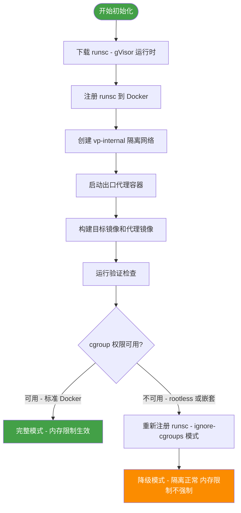
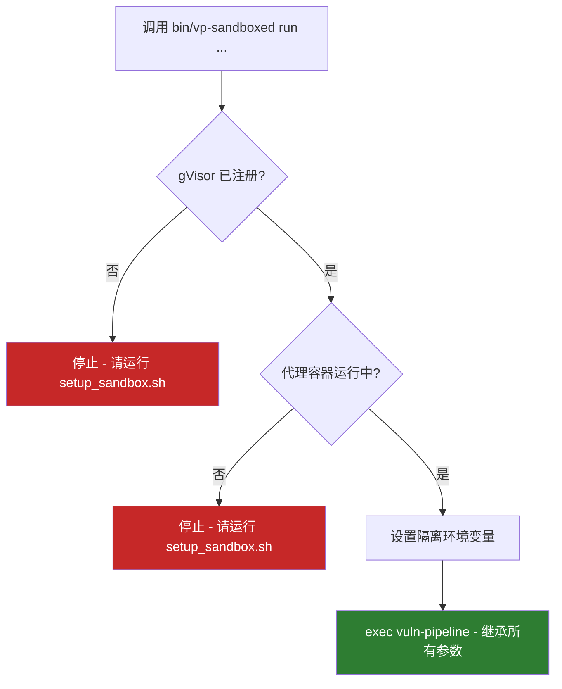

# 代理沙箱详解

> 本文档介绍本参考实现中沙箱的具体实现细节。关于沙箱的通用建议和最佳实践，请参阅[博文中的沙箱章节](blog-post.md#2-sandbox-run-agents-safely-and-verify-exploitability)。

---

## 一、设计哲学：可信代码 vs 不可信代理

管道由两类截然不同的组件构成，它们的信任级别不同，运行环境也不同：

```
┌─────────────────────────────────────────────────────────┐
│                    可信区域（主机）                       │
│                                                         │
│   vuln-pipeline 编排进程                                 │
│   · 纯 Python，确定性                                    │
│   · 不执行目标代码                                        │
│   · 不运行模型选定的命令                                   │
│   · 可不沙箱运行                                          │
│                                                         │
│         │  docker exec / docker cp                      │
│         ▼  （唯一的数据通道）                             │
├─────────────────────────────────────────────────────────┤
│                  隔离区域（容器）                          │
│                                                         │
│   claude -p 代理进程                                     │
│   · 非确定性，可执行任意命令                               │
│   · 运行在 gVisor 容器内                                  │
│   · 与目标二进制和源码共处一容器                            │
│                                                         │
└─────────────────────────────────────────────────────────┘
```

核心原则：**只有不可信的代理进入沙箱，编排代码始终保持在主机侧。**

---

## 二、两层隔离架构

沙箱通过两个独立的隔离层共同保护主机：

```
              ┌────────────────────────────────────────────────────────┐
              │                    主机 Host                            │
              │                                                        │
              │           vuln-pipeline 编排进程                        │
              │                    │                                   │
              └────────────────────┼───────────────────────────────────┘
                                   │ docker exec / docker cp
                                   │ （PoC 字节 + 结果，唯一数据通道）
                                   ▼
 ┌──────────────── vp-internal 隔离网络（--internal，无公网路由） ──────────────────┐
 │                                                                                │
 │  ┌──────────────── gVisor 容器（runsc 运行时） ──────────────────────────────┐  │
 │  │                                                                           │  │
 │  │   claude -p 代理进程                   目标二进制 + 源代码                 │  │
 │  │           │                                                               │  │
 │  │           ▼                                                               │  │
 │  │   gVisor 用户态内核（拦截所有系统调用，不直接暴露主机内核）                  │  │
 │  │                                                                           │  │
 │  └───────────────────────────────────────────────────────────────────────────┘  │
 │                            │ 所有出站流量                                        │
 │                            ▼                                                    │
 │               出口代理 allowlist proxy（egress_proxy.py）                        │
 │                     │                      │                                    │
 └─────────────────────┼──────────────────────┼────────────────────────────────────┘
                        │                      │
             允许       │                      │  阻断所有其他目标
                        ▼                      ▼
           api.anthropic.com:443          其他所有主机
```

### 第一层：gVisor 内核隔离

gVisor（`runsc`）在**用户空间**实现了一套完整的 Linux 内核接口，拦截代理发出的每一个系统调用。

```
代理进程发出系统调用
        │
        ▼
  gVisor Sentry（用户态）
  · 验证调用合法性
  · 执行 gVisor 自己的内核逻辑
        │
        ▼
  主机内核（最小化暴露面）

  ← 主机内核不直接看到代理的系统调用 →
```

### 第二层：网络出口管控

代理容器接入 `vp-internal` Docker 网络，该网络**没有到公网的路由**。唯一的出口是同网络内的白名单代理容器（`egress_proxy.py`）：

```
代理容器
    │
    │  HTTPS_PROXY=http://<proxy_ip>:3128
    ▼
egress_proxy.py
    ├── 目标 == api.anthropic.com:443 ──► ✅ CONNECT 建立隧道
    └── 其他所有目标 ───────────────────► ❌ 403 Forbidden
```

---

## 三、隔离效果对比

| 攻击面 | 无沙箱 | 有沙箱 |
|--------|--------|--------|
| **文件系统** | 可读写主机任意文件 | 仅限容器内文件系统 |
| **Shell 执行** | 在主机 shell 执行命令 | 在 gVisor 容器 shell 内（独立内核） |
| **网络出口** | 主机具备的所有网络访问 | 仅 `api.anthropic.com:443` |
| **主机耦合** | 完全耦合 | 仅通过 `docker exec cat`（PoC 输出）和 `-v found_bugs.jsonl:ro`（只读挂载） |
| **内核暴露** | 代理直接使用主机内核 | 代理使用 gVisor 用户态内核 |
| **凭据安全** | 凭据与目标代码共存主机 | 凭据仅在容器内，容器销毁即消失 |

---

## 四、一次性初始化

每台机器只需运行一次（需要 `sudo`，可安全重复执行）：

```bash
./scripts/setup_sandbox.sh
```

### 初始化流程



### 自定义配置

| 配置项 | 方法 | 默认值 |
|--------|------|--------|
| 允许额外出口主机 | `VP_EGRESS_ALLOW=host-1:443,host-2:443` | 仅 `api.anthropic.com:443` |
| 指定 gVisor 版本 | `RUNSC_RELEASE=<yyyymmdd>` | 脚本内置固定版本 |
| 更新白名单 | 修改环境变量后重新运行脚本 | — |

> **平台说明：** gVisor 仅支持 Linux。在 macOS 或 Windows 上，请在 Linux 虚拟机内运行，或使用 `--dangerously-no-sandbox`（见下文）。

---

## 五、沙箱模式运行

### 启动命令

```bash
export ANTHROPIC_API_KEY=...

bin/vp-sandboxed run drlibs \
  --model <model-id> \
  --runs 3 \
  --parallel \
  --stream
```

### vp-sandboxed 启动逻辑



设置的三个关键环境变量：`VULN_PIPELINE_AGENT_RUNTIME=runsc`、`VULN_PIPELINE_EGRESS_PROXY=http://<proxy_ip>:3128`、`VULN_PIPELINE_AGENT_NETWORK=vp-internal`。

`vp-sandboxed` 是 `vuln-pipeline` 的安全封装：**检查通过才启动，任何环节缺失即中止**，不会悄悄降级为无沙箱模式。

---

## 六、手动验证隔离效果

以下 4 个命令可独立验证每一层隔离是否生效：

### 验证 1：gVisor 内核确实在用

```bash
# 沙箱容器的内核版本应与主机不同
docker run --rm --runtime=runsc vuln-pipeline-drlibs-latest-agent:latest uname -r
uname -r
```

预期结果：**两行输出不同**（gVisor 使用自己的内核版本字符串）

### 验证 2：主机文件系统不可达

```bash
echo host > /tmp/probe-$$; \
  docker run --rm --runtime=runsc \
  vuln-pipeline-drlibs-latest-agent:latest \
  cat /tmp/probe-$$
```

预期结果：**`No such file or directory`**（容器看不到主机的 `/tmp`）

### 验证 3：可访问模型 API

```bash
docker run --rm --runtime=runsc \
  --network=vp-internal \
  -e HTTPS_PROXY=http://<proxy_ip>:3128 \
  vuln-pipeline-drlibs-latest-agent:latest \
  sh -c 'curl -sI https://api.anthropic.com/ -o /dev/null -w "%{http_code}\n"'
```

预期结果：**打印出 HTTP 状态码**（如 `200` 或 `4xx`，能连接即为通过）

### 验证 4：其他主机被阻断

```bash
docker run --rm --runtime=runsc \
  --network=vp-internal \
  -e HTTPS_PROXY=http://<proxy_ip>:3128 \
  vuln-pipeline-drlibs-latest-agent:latest \
  sh -c 'curl -sI https://example.com/ -o /dev/null -w "%{http_code}\n"'
```

预期结果：**连接被拒绝**（代理返回 `403` 或连接超时）

### 验证结果速查

| 验证项 | 预期结果 | 失败说明 |
|--------|----------|----------|
| 内核版本不同 | ✅ 两行不同 | gVisor 未生效，代理在主机内核上运行 |
| 主机文件不可达 | ✅ 报错 | 文件系统隔离失败 |
| API 可访问 | ✅ 有状态码 | 代理无法调用模型，管道会失败 |
| 其他主机被阻断 | ✅ 拒绝连接 | 网络出口管控失败 |

---

## 七、关闭沙箱（不推荐）

```bash
vuln-pipeline run <target> --dangerously-no-sandbox ...
```

使用此标志后，代理依然在 Docker 容器内运行，但防护大幅削弱：

```
有沙箱                          无沙箱（--dangerously-no-sandbox）
────────────────────────────    ─────────────────────────────────
gVisor 用户态内核                主机内核（直接暴露）
vp-internal 隔离网络             普通 Docker 网络（完整公网访问）
白名单代理（仅 API）              无出口管控
凭据与目标隔离                   凭据和目标代码在同一容器内
```

> **适用场景：** 仅用于在一次性虚拟机上进行开发调试。生产或真实安全研究场景中请始终使用沙箱。

---

## 八、沙箱信任边界示意

```
┌─────────────────────────────────────────────────────────────────┐
│  主机（可信）                                                     │
│                                                                  │
│  vuln-pipeline ──┬── docker build  ──► 目标镜像（只读快照）       │
│                  │                                               │
│                  ├── docker run ──► 代理容器（gVisor）            │
│                  │                      │                        │
│                  │              ┌───────┴────────┐               │
│                  │              │ claude -p 代理  │               │
│                  │              │ 目标二进制/源码  │               │
│                  │              │ gVisor 内核     │               │
│                  │              └───────┬────────┘               │
│                  │                      │                        │
│                  ├── docker cp ◄─── PoC 字节（唯一出口）          │
│                  │                                               │
│                  └── docker exec cat ◄─ 崩溃输出                 │
│                                                                  │
│  信任边界：主机只通过 docker cp / docker exec 接收数据             │
│  代理生成的所有文件均保留在容器内，不自动进入主机                    │
└─────────────────────────────────────────────────────────────────┘
```

---

## 九、常见问题

**Q：为什么不直接用普通 Docker，不用 gVisor？**

普通 Docker 容器共享主机内核，若目标代码或代理触发内核漏洞，可能逃逸到主机。gVisor 在用户空间实现内核，大幅缩小攻击面。

**Q：gVisor 会显著影响性能吗？**

系统调用密集的操作（如大量文件 I/O）会有 10-30% 的额外开销，但对于这个管道以 Claude API 调用为主要瓶颈的场景，实际影响可以忽略。

**Q：白名单代理如何处理 TLS？**

代理使用 HTTP CONNECT 隧道：代理只负责建立 TCP 连接到目标主机，TLS 握手在代理内部端对端完成，代理看不到加密内容。

**Q：rootless Docker 或嵌套 Docker 环境下有何差异？**

初始化脚本会自动检测并以 `--ignore-cgroups` 重新注册 `runsc`。内核隔离、网络管控、文件系统隔离均不受影响，唯一的损失是 `--memory` 限制不被强制执行。
